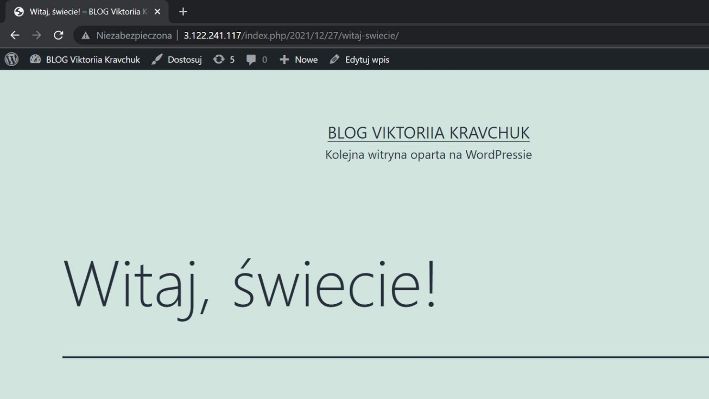

### Opis kroków instalacji
* Instalacja Apache, HTTP Servera, ngnix
* Instalacja interpretera PHP
* Start Apache
* Konfiguracja Apache, katalogu root
* Pobieranie Wordpress
* Instalacja MariaDB
* Utworzenie użytkownika i nadanie mu uprawnień 
* Zrestartowanie serwera

